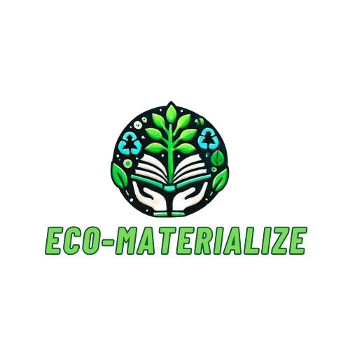

# FECAP - Fundação de Comércio Álvares Penteado

# Projeto ECO-MATERALIZE

## Nome do Grupo - ECOMATERALIZE

## Integrantes: <a href="https://www.linkedin.com/in/felipe-lima-476b71236/">Felipe Lima</a>, <a href="https://www.linkedin.com/in/cenedeze-undefined-37664a288/">João Vitor Cenedeze</a>, <a href="https://www.linkedin.com/in/leon-ribeiro-boaventura-aa1736272/">Leon Ribeiro Boaventura</a>, <a href="https://www.linkedin.com/in/lucas-oliveira-batista-b704a52ba/">Lucas Oliveira Batista</a>

## Professores Orientadores: <a href="https://www.linkedin.com/in/victorbarq/">Victor Rosetti</a>, <a href="https://www.linkedin.com/in/aimarlopes/">Aimar Lopes</a>, <a href="https://www.linkedin.com/in/eduardo-savino-gomes-77833a10/">Eduardo Savino</a>, <a href="https://www.linkedin.com/in/francisco-escobar/">Francisco Escobar (Chico)</a>, <a href="https://www.linkedin.com/in/jbuesso/">José Buesso</a>

## Descrição

  

Nosso projeto (Eco-Materialize) consiste em uma plataforma web voltada para arrecadação de doações financeiras (R$) e materiais escolares em bom estado. O objetivo é garantir o acesso à educação de qualidade a todas as pessoas de diferentes classes sociais que enfrentam dificuldades. Além de promover a educação inclusiva, a plataforma também considera a preservação ambiental, incentivando a reutilização de materiais e minimizando o desperdício. Desta forma, buscamos impactar positivamente a sociedade e o meio ambiente, promovendo sustentabilidade e igualdade de oportunidades.

## 🛠 Estrutura de pastas

-Raiz 
| 
|-->documentos 
  &emsp;|-->Requisitos_Funcionais-NaoFuncionais.pdf 
|-->imagens 
&emsp;|-->Pagina_Home.png 
|-->src 
  &emsp;|-->Backend 
     &emsp;|-->ECO-MATERALIZE.sln 
  &emsp;|-->Frontend 
     &emsp;|-->ECO-MATERALIZE.js 
      &emsp;|-->ECO-MATERALIZE.html 
       &emsp;|-->ECO-MATERALIZE.css 
         &emsp;|-->Cadastro.css 
             &emsp;|-->Cadastro.html 
                 &emsp;|-->.vscode 
       
|readme.md 

A pasta raiz contem dois arquivos que devem ser alterados:

<b>README.MD</b>: Arquivo que serve como guia e explicação geral sobre seu projeto. O mesmo que você está lendo agora.

Há também 4 pastas que seguem da seguinte forma:

<b>documentos</b>: Toda a documentação estará nesta pasta.

<b>imagens</b>: Imagens do sistema

<b>src</b>: Pasta que contém o código fonte.

## 🛠 Instalação
Não é necessário para o momento.

## 🎨 Figma
Clique no link para ter acesso ao Figma da ECO-MATERALIZE: https://www.figma.com/design/78ObN2cpkk9v4byUwxt13U/GUIA-DO-ESTILO?node-id=0-1&t=Ow1qDd5EZVHmnLPi-1
## 🗃 Histórico de lançamentos

A cada atualização os detalhes devem ser lançados aqui.
* 0.2.6 - 10/10/2024
    * Backlog das classes e seus atributos.
* 0.2.5 - 22/09/2024
    * Criação do JS.
    * Teste de implementação e validação dos arquivos no VSCode.
* 0.2.4 - 29/09/2024
    * Projeto das páginas de cadastro e log-in feito.
* 0.2.3 - 19/09/2024
    * Mapa de navegação do site definido.
    * Figma do projeto atualizado.
* 0.2.2 - 15/09/2024
    * Ideia para a logo do projeto.
* 0.2.1 - 05/09/2024
    * Primeiro protótipo do HTML e do CSS lançados
    * Definição das ideias de card e banner do projeto.
* 0.2.0 - 03/09/2024
    * Definição do projeto no Figma e ideia do banner implementada.
    * Definição de atributos da classe Evento.
* 0.1.1 - 28/08/2024
    * Definição da paleta de cores.
* 0.1.0 - 22/08/2024
    * Definição da ideia e ODS do projeto.
    * Wireframe definido por membros do grupo.
* 0.0.1 - 10/08/2024
    * Início do projeto.

## 📋 Licença/License

Este trabalho está licenciado sob <a href="https://creativecommons.org/licenses/by/4.0/?ref=chooser-v1" target="_blank" rel="license noopener noreferrer" style="display:inline-block;">CC BY 4.0</a>

## 🎓 Referências

Aqui estão as referências usadas no projeto.

1. <https://github.com/iuricode/readme-template](https://amigoedu.com.br/blogdoamigo/doar-livros-usados>
2. <https://github.com/gabrieldejesus/readme-model](https://leituraparatodossp.com.br/>
3. <https://creativecommons.org/share-your-work/](https://capital.sp.gov.br/web/cultura/w/bibliotecas/servicos/9705>

